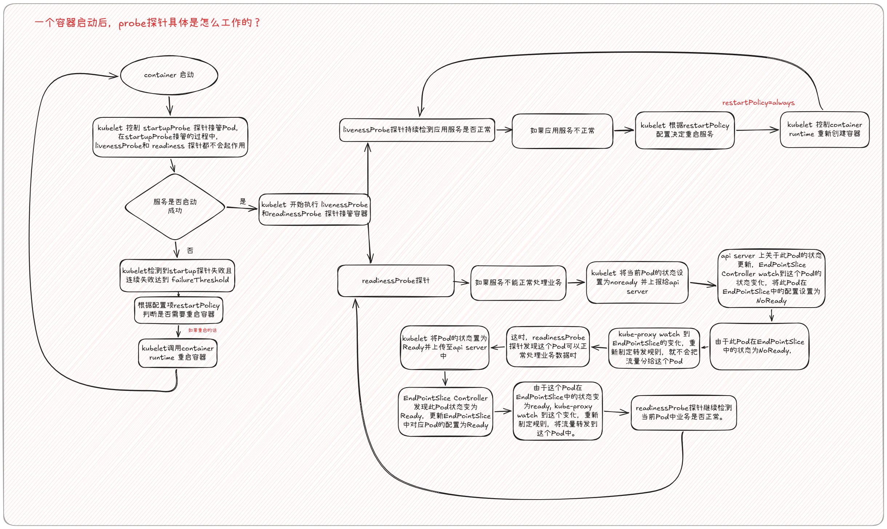

Kubernetes 中的探针用于判断容器内应用的健康状态。

需要注意：

> Kubernetes 能知道容器进程是否还在运行，但“进程还活着”并不代表“应用还能正常提供服务”。

因此 Kubernetes 提供了三种探针：

```
startupProbe
livenessProbe
readinessProbe
```

---

## 1. livenessProbe

`livenessProbe` 用于判断：

> **应用是否还处于健康状态，是否已经坏到需要重启容器。**

它不是单纯判断“进程存不存在”。

因为如果容器主进程直接退出，Container Runtime 和 kubelet 本身就能知道，并根据 `restartPolicy` 处理。

livenessProbe 更重要的用途是判断这种情况：

```
进程还存在
    ↓
但是应用已经死锁 / 卡死 / 无法响应
    ↓
容器仍然显示 Running
```

**此时 kubelet 可以通过 livenessProbe 判断应用已经异常,并重启容器。**

典型配置：

```
livenessProbe:
  httpGet:
    path: /health/live
    port: 8080
  periodSeconds: 10
  failureThreshold: 3
```

如果连续失败达到阈值：

```
livenessProbe 失败
        ↓
kubelet 判断应用不健康
        ↓
重启容器
```

### 为什么不推荐只用 `ps` 判断？

例如：

```
ps -ef | grep nginx
```

只能说明：

```
nginx 进程存在
```

但：

```
进程存在
≠
应用能够正常处理请求
```

应用可能出现：

```
死锁
线程卡死
事件循环阻塞
内部逻辑异常
```

因此对于 Web 服务，更常见的做法是提供健康检查接口：

```
/health/live
```

由应用自己判断内部状态。

---

## 2. readinessProbe

`readinessProbe` 用于判断：

> **当前 Pod 是否已经具备接收业务流量的能力。**

如果 readinessProbe 失败：

```
Pod 仍然运行
容器不会被重启
但是 Pod 会变成 NotReady
```

然后 Kubernetes 更新它在 Service 的后端 Endpoint 中状态为noReady。

流程：

```
readinessProbe 失败
        ↓
Pod Ready = False
        ↓
EndpointSlice 更新
        ↓
Service 不再把流量发给该 Pod
```

例如：

```
readinessProbe:
  httpGet:
    path: /health/ready
    port: 8080
  periodSeconds: 5
  failureThreshold: 2
```

---

## 3. liveness 与 readiness 的区别

这是探针中最核心的区别。

可以记：

> **liveness：我是不是坏到需要重启？**

> **readiness：我现在能不能接流量？**

例如应用数据库断开：

```
应用主进程正常
Web 服务正常
数据库连接失败
```

合理状态通常应该是：

```
livenessProbe  → 成功
readinessProbe → 失败
```

结果：

```
容器不重启
但是暂时不接收 Service 流量
```

等数据库恢复后：

```
readinessProbe → 成功
```

更新 Pod 在 Service 后端 endPointSlice 的状态为 ready=true。

---

## 4. liveness 不应该检查过多外部依赖

例如 Web 应用依赖 MySQL。

如果把 MySQL 状态加入 liveness：

```
MySQL 故障
    ↓
所有 Web Pod liveness 失败
    ↓
所有 Pod 被不断重启
    ↓
MySQL 仍然没有恢复
```

这可能造成：

```
Restart Storm
重启风暴
```

因此 livenessProbe 一般应该重点判断：

> **应用自身是否已经异常到需要重启。**

而数据库、Redis、下游服务等是否可用，更适合根据业务情况放在 readinessProbe 中。

可以记成：

> **重启容器能解决的问题，适合 liveness。**

> **只是暂时不能接流量的问题，适合 readiness。**

---

## 5. startupProbe

`startupProbe` 用于判断：

> **应用是否已经完成启动。**

它主要用于慢启动程序。

例如一个 Java 应用需要 90 秒启动：

```
容器启动
  ↓
加载配置
  ↓
连接数据库
  ↓
初始化缓存
  ↓
JVM 预热
  ↓
90 秒后真正启动完成
```

如果直接使用 livenessProbe：

```
livenessProbe:
  periodSeconds: 10
  failureThreshold: 3
```

可能出现：

```
10 秒失败
20 秒失败
30 秒失败
    ↓
livenessProbe 失败
    ↓
容器被重启
```

于是应用永远无法真正完成启动。

这时可以使用：

```
startupProbe:
  httpGet:
    path: /health/startup
    port: 8080
  periodSeconds: 10
  failureThreshold: 12
```

大约允许：

```
10 × 12 = 120 秒
```

的启动时间。

在 startupProbe 成功之前：

```
livenessProbe    暂不执行
readinessProbe   暂不执行
```

当 startupProbe 成功：

```
startupProbe 成功
       ↓
应用启动完成
       ↓
livenessProbe + readinessProbe 开始工作
```

---

## 6. 三种探针的整体关系

```
Container 启动
      ↓
startupProbe
      ↓
是否启动完成？
      │
      ├── 否 → 继续等待
      │
      └── 是
           ↓
    ┌──────────────┐
    ↓              ↓
livenessProbe   readinessProbe
    ↓              ↓
是否需要重启？   是否能接流量？
    ↓              ↓
失败             失败
    ↓              ↓
重启容器       从 Service 后端移除(口语化的描述)
```



一句话总结：

```
startupProbe
→ 启动完了吗？

livenessProbe
→ 还健康吗？需要重启吗？

readinessProbe
→ 现在能接流量吗？
```

---

## 7. 探针的检测方式

Kubernetes 常见有三种探测方式。

### HTTP 探针

适合 Web 服务。

```
livenessProbe:
  httpGet:
    path: /health/live
    port: 8080
```

kubelet 会访问：

```
http://PodIP:8080/health/live
```

根据 HTTP 响应判断探测是否成功。

---

### TCP 探针

用于判断 TCP 端口是否能够建立连接。

```
livenessProbe:
  tcpSocket:
    port: 3306
```

适合：

```
数据库
TCP 服务
自定义网络服务
```

---

### Exec 探针

在容器中执行命令，根据退出码判断。

```
livenessProbe:
  exec:
    command:
      - sh
      - -c
      - test -f /tmp/healthy
```

规则：

```
退出码 0
→ 成功

非 0
→ 失败
```

---

## 8. 使用文件作为健康状态时的注意点

例如：

```
test -f /tmp/status
```

只能判断文件是否存在。

如果：

```
应用启动时创建 /tmp/status
后来应用死锁
```

这个文件仍然存在。

于是：

```
应用已经异常
test -f 仍然成功
```

所以如果使用文件 heartbeat，更合理的方法是：

```
应用周期性更新文件时间
```

然后判断文件是否最近更新过。

例如：

```
test $(($(date +%s) - $(stat -c %Y /tmp/status))) -lt 10
```

意思是：

> `/tmp/status` 最近 10 秒内是否更新过。

---

## 9. 常见探针参数

例如：

```
livenessProbe:
  httpGet:
    path: /health/live
    port: 8080
  initialDelaySeconds: 5
  periodSeconds: 10
  timeoutSeconds: 2
  failureThreshold: 3
  successThreshold: 1
```

字段含义：

```
initialDelaySeconds
容器启动后等待多久再开始探测

periodSeconds
多久探测一次

timeoutSeconds
单次探测允许等待多久

failureThreshold
连续失败多少次才判定失败

successThreshold
连续成功多少次才恢复成功状态
```

例如：

```
periodSeconds: 10
failureThreshold: 3
```

可以近似理解为：

```
连续约 30 秒探测失败
→ 才采取相应动作
```

---

## 10. `initialDelaySeconds` 和 `startupProbe` 的区别

两者都可以避免应用刚启动就被 liveness 误判。

但是：

```
initialDelaySeconds: 120
```

代表：

> 无论应用 20 秒还是 100 秒启动，都固定等 120 秒。

而 startupProbe：

```
应用一旦真正启动成功
    ↓
startupProbe 马上成功
    ↓
立即进入正常健康检查
```

因此慢启动应用更推荐：

```
startupProbe
```

而不是单纯设置很大的 `initialDelaySeconds`。

---

## 11. 探针由谁执行？

探针由：

```
kubelet
```

负责执行。

因为 kubelet 本身就负责 Node 上 Pod 和容器的生命周期管理。

### readiness 失败

```
kubelet
   ↓
执行 readinessProbe
   ↓
探针失败
   ↓
更新 Pod Ready 状态
   ↓
EndpointSlice 更新
   ↓
Service 不再转发流量到该 Pod
```

### liveness 失败

```
kubelet
   ↓
执行 livenessProbe
   ↓
连续失败
   ↓
根据 restartPolicy
   ↓
重启容器
```

---

## 12. Running 不等于 Ready

这是一个非常重要的 Kubernetes 概念。

执行：

```
kubectl get pod
```

可能看到：

```
NAME         READY   STATUS    RESTARTS
probe-demo   0/1     Running   0
```

这里：

```
STATUS = Running
```

说明：

> 容器进程正在运行。

而：

```
READY = 0/1
```

说明：

> readinessProbe 没有通过，目前不应该接收业务流量。

因此：

> **Running 只代表容器在运行，Ready 才代表 Pod 当前适合接收流量。**

---

## 13. 一个完整示例

```
apiVersion: v1
kind: Pod
metadata:
  name: probe-demo

spec:
  containers:
    - name: web
      image: nginx
      ports:
        - containerPort: 80

      startupProbe:
        httpGet:
          path: /
          port: 80
        periodSeconds: 2
        failureThreshold: 15

      livenessProbe:
        httpGet:
          path: /
          port: 80
        periodSeconds: 10
        failureThreshold: 3

      readinessProbe:
        httpGet:
          path: /
          port: 80
        periodSeconds: 5
        failureThreshold: 2
```

含义：

```
startupProbe：
每 2 秒检查一次
最多允许失败 15 次
约给应用 30 秒启动时间

livenessProbe：
每 10 秒检查一次
连续失败 3 次
→ 重启容器

readinessProbe：
每 5 秒检查一次
连续失败 2 次
→ Pod 变为 NotReady
```

---

## 14. 生产环境常见健康接口设计

很多 Web 应用会分别提供：

```
/health/live
/health/ready
```

例如：

```
/health/live
检查：
应用主线程
核心组件
事件循环
内部状态

/health/ready
检查：
数据库
Redis
初始化状态
必要的下游依赖
```

于是：

```
livenessProbe:
  httpGet:
    path: /health/live
    port: 8080

readinessProbe:
  httpGet:
    path: /health/ready
    port: 8080
```

虽然都是 HTTP 探针，但检测逻辑完全不同。

---

## 总结

可以用下面三句话记住 Kubernetes 探针：

> **startupProbe：应用启动完成了吗？**

> **livenessProbe：应用是否已经异常到需要重启？**

> **readinessProbe：应用现在是否能够接收业务流量？**

再加一句生产环境判断原则：

> **重启能解决的问题放 liveness，暂时不能接流量的问题放 readiness。**
