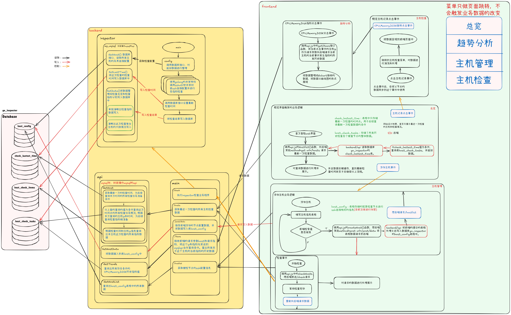
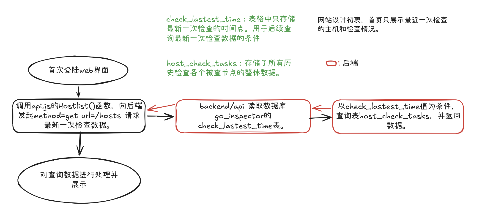
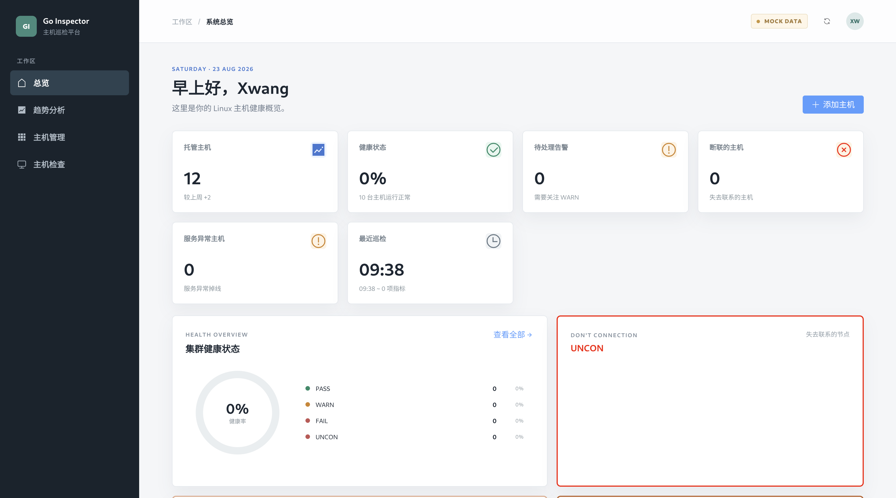
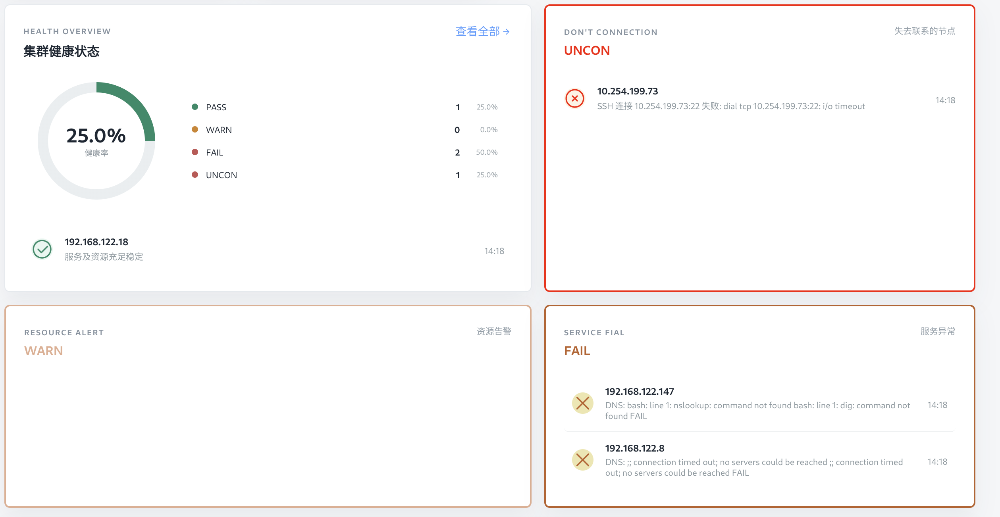
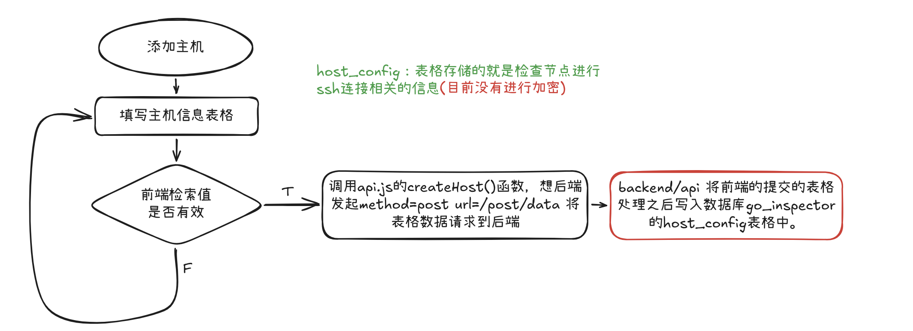
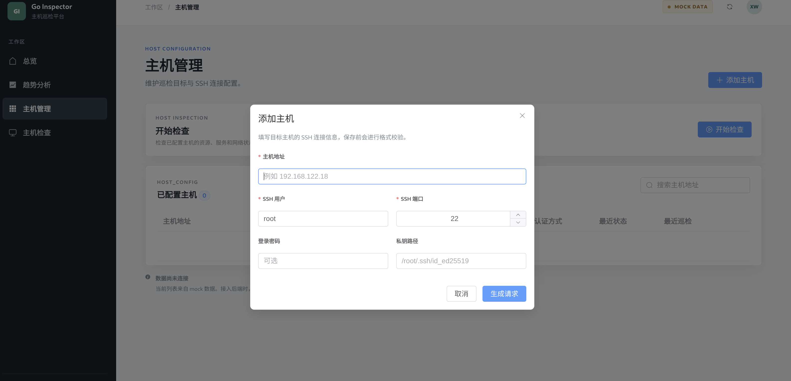

## 1. 项目介绍

### 1.1. 项目结构及介绍

> 整体结构

```shell
xwang@xwangl:~/ComputerStudy/FirstProject/inspectra$ tree
.
├── backend
│   ├── api
│   └── inspector
├── compose.yml
├── deploy
│   ├── api
│   ├── frontend
│   └── mysql
├── docs
├── frontend
└── README.md
```

> `backend/api`: 用来接收前端的请求并作出相应的处理。
>
> `backend/inspector`: 检查程序，基于go语言进行编写。使用ssh协议对节点进行检查
>
> `deploy`: 准备好的docker镜像制作上下文
>
> `docs`: `README.md`引用的图片等资源
>
> `frontend`: 前端应用

### 1.2. 项目架构



## 2. 部署步骤

> 本项目基于docker服务运行，使用前需要自行配置好docker环境

分别进入目录`deploy`下的三个子目录执行下面的命令

#### `deploy/api/`目录下执行

`goinspector/backend:1.1` 我的go使用的是官方包仓库，所以使用 `--build-arg`指定系统代理，**按需修改.**

```shell
docker build --network=host --build-arg http_proxy=http://127.0.0.1:7890 --build-arg https_proxy=http://127.0.0.1:7890 -f Dockerfile -t goinspector/backend:1.1 ../../backend/
```


#### `deploy/frontend/`目录下执行

`goinpector/frontend:1.1`

```shell
cp *.conf ../../ ## 将定制的nginx配置文件移动到镜像构建上下文的根目录上，为构建镜像做准备。
docker build -f Dockerfile -t goinspector/frontend:1.1 ../../
```


#### `deploy/mysql/`目录下执行

`goinpector/mysql:1.1`

```shell
docker build -f Dockerfile -t goinspector/mysql:1.1 .
```


### 启动容器

到目录`go-inspector/`下

```shell
docker compose up -d
```


浏览器访问`localhost:8080`端口验证服务是否启动成功。


## 3. web界面讲解


### 3.1. 总览界面介绍


#### 3.1.1. 首次登陆



> **界面展示：** 12是静态数据暂时还没有修改，白天实习上班，晚上的时间还是分给更重要的事情。 



> **注意：** 首次登陆数据库中没有数据，会显示上面的界面，需要手动添加主机

#### 3.1.2. 具体主机节点状态展示



> 上面四个模块中，PASS，WARN，FAIL中的记录都是可以点击跳转的。**而`UNCON`中的记录，不能点击跳转**。
>
> **设计思路：** 点击这些主机记录时，会跳转到主机的详细信息界面，这个界面展示了所有检查指标的状态。
>
> `UNCON`代表的含义是断联主机，断联主机没有办法进行检查，自然没有检查指标所以`UNCON`主机记录是没有点击跳转事件的。
>
> `WARN`代表服务告警。`FAIL`代表服务异常，比如没有服务未启动等。`PASS`代表主机的所有服务都是健康。

**点击主机记录事件**


### 3.2. 添加主机

当在总览或者主机管理界面点击添加主机时，会触发添加主机业务逻辑。



> **界面展示：** 




### 前端业务逻辑示意图：


